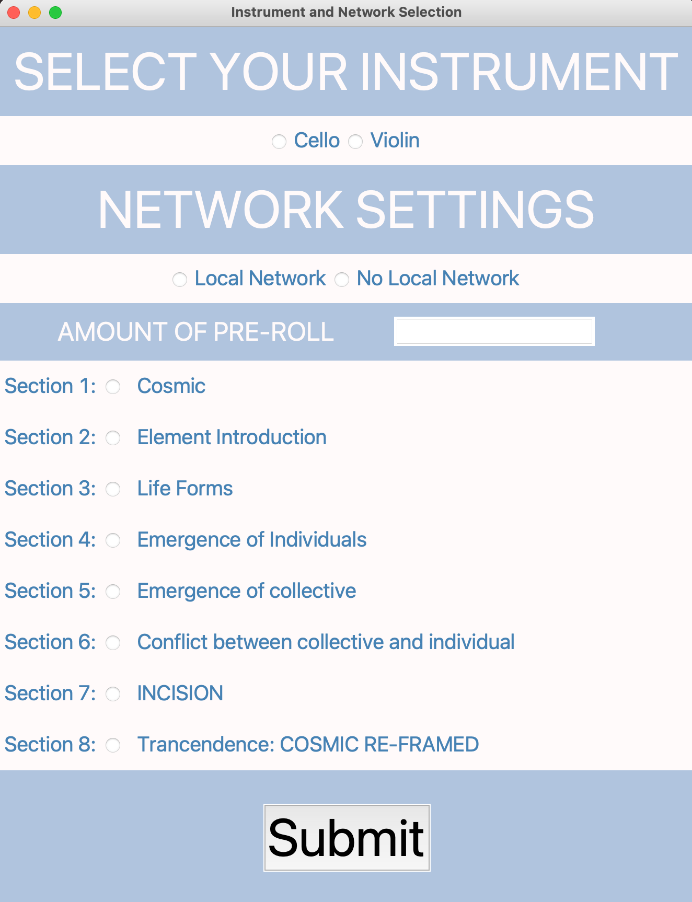
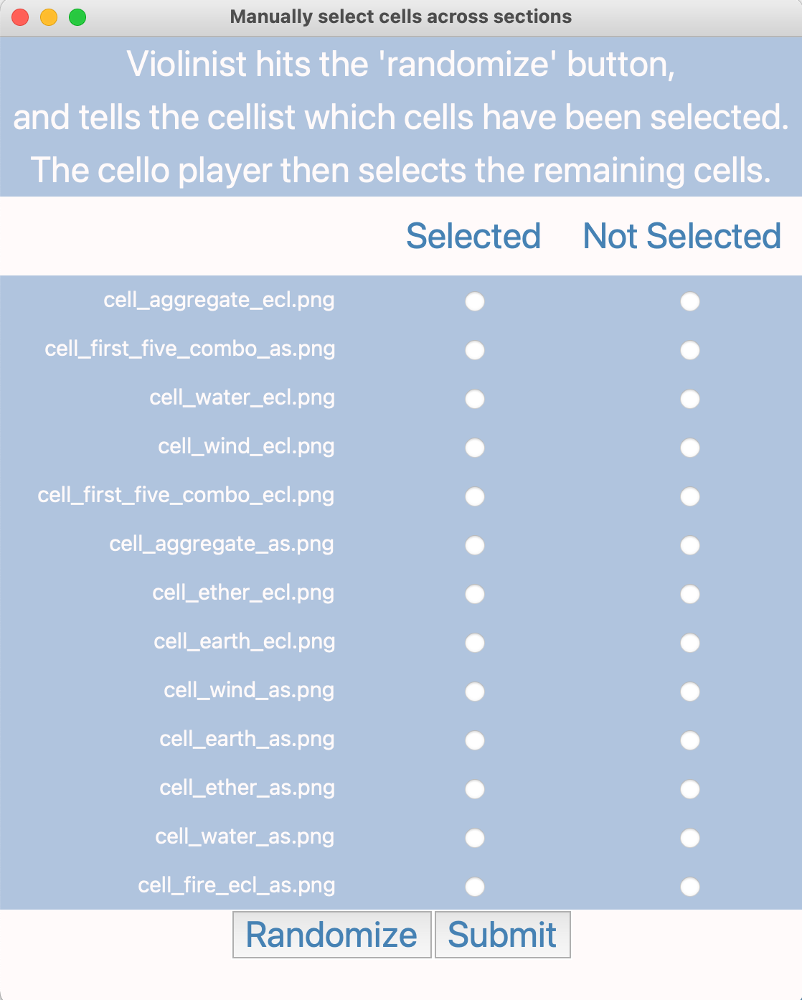
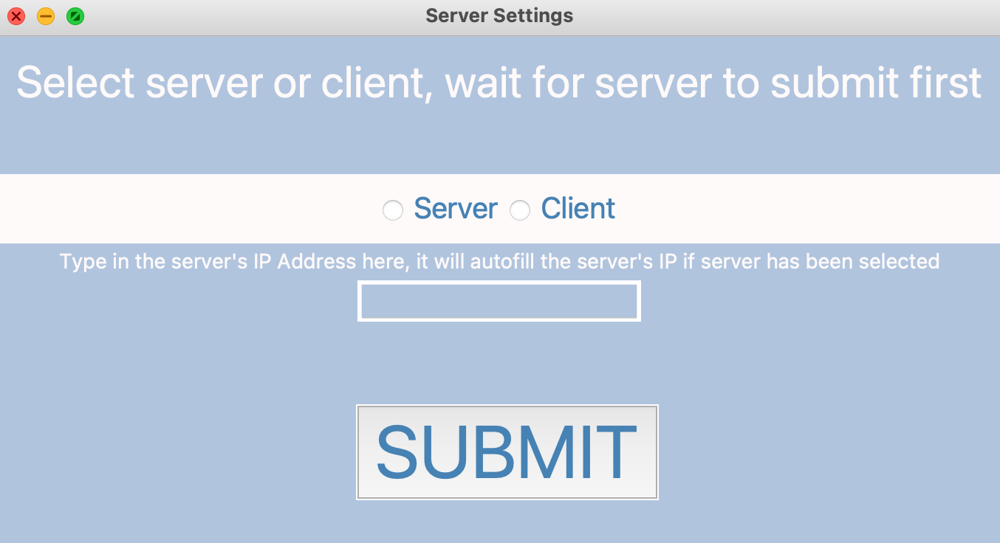
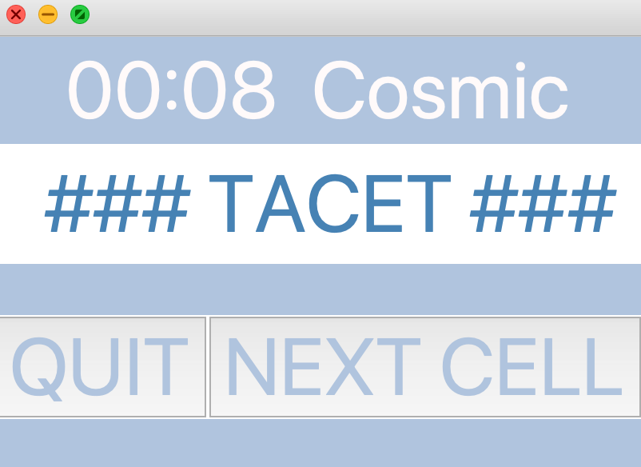
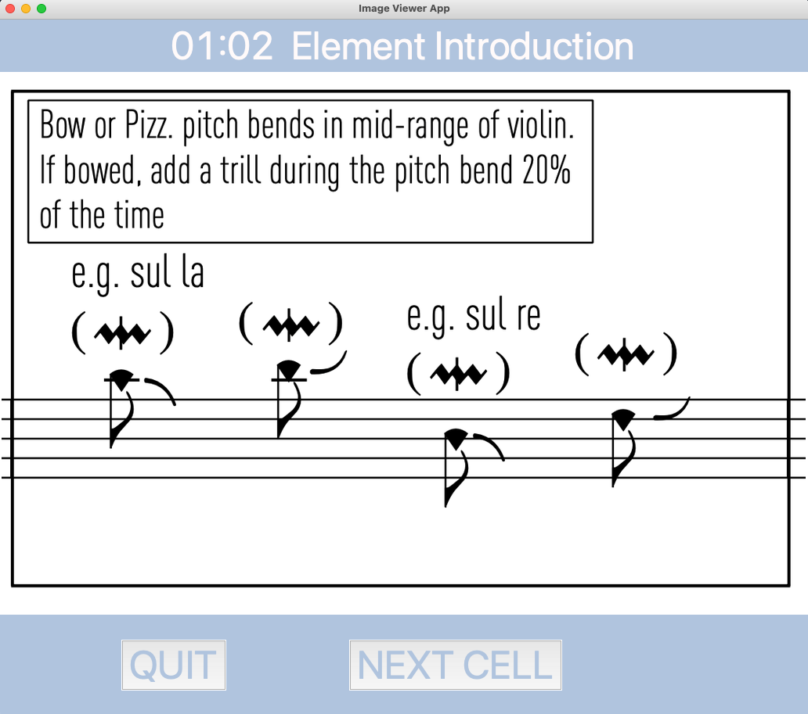

# ABOUT THE PROJECT

Code by <a href=https://ericlemmon.net/>Eric Lemmon</a>, scores and music by <a href=https://www.annesophieandersen.com/>
Anne Sophie Andersen</a> and Eric Lemmon

This repository holds the scores, instructions, and code for the collaboration between Anne Sophie Andersen 
and Eric Lemmon for their work titled:

### **From Elemental Singularities to Unified Complexities:**

###### a microcosmic journey

The work will be premiered on the 2021 New Music for String festival
held in Aarhus and Copenhagen Denmark.

## INSTRUCTIONS FOR RUNNING THE SOFTWARE

If you haven't installed Python, 
<a href=https://www.python.org/downloads/>install it by downloading it here.</a>
The software has been tested in Python 3.8 and up.

Navigate to the directory that you want to the folder to be downloaded to in the
CLI of your choice (e.g. terminal on mac):

`cd Users/your_user_name_here/Desktop`

Download the software by copying this into the CLI. You may be asked to 
install xcode developer tools on Mac. Do so if asked:

`git clone https://github.com/eclemmon/new_music_for_strings.git`

Install Pillow, a necessary python package:

`python3 -m pip install Pillow`

Navigate into the directory:

`cd new_music_for_strings`

Run the program:

`python3 main.py`

## ON BOOT

### Instrument and Network Selection

There are several options to select from when the program runs.

###### SELECT YOUR INSTRUMENT OPTIONS

Selecting cello or violin will define the scores that the respective player
receives.

If the players are co-located and on the same local network, they
can select the local network option to automatically distribute
the scores available to each player.

If the players are not co-located or not on the same local network,
they can set the score distribution manually.

###### TRIGGER NEXT IMAGE OPTIONS

The GUI offers three means by which a performer can select next the next image.
If the performer is using a page turning foot pedal (<a href=https://www.pageflip.com/>like so</a>),
the performer can map the foot pedal to the left mouse button on their computer
and tapping the pedal with the mouse cursor over the window will get the next
image when the 'foot pedal' option is selected. The 'space bar' option is a 
convenience option for performance if the performer has no foot pedal available 
to them. In this case, the space bar will be an available trigger button that 
gets the next graphic or notated cell since the spacebar is a large key and 
towards the front of a laptop's keyboard. The 'next button' option, will only
get images when the large 'next' button in the window is clicked. In all cases
the next button will still work.

###### AMOUNT OF PRE-ROLL

Enter a number that displays how many seconds in time before the work
starts. This is helpful in both performance and rehearsal settings.

###### SECTIONS

The section selection buttons are for rehearsal purposes. To start
at the beginning of the piece, simply select Section 1. 

### Set Scores Manually

As described in the GUI, the violinist (or alternatively, the cellist)
hits the randomize button, and then tells the other player which cells are 
'not selected'. The other player then selects those options and 'not
selected' for the options the violinist has as 'selected'.

### Set Scores Automatically

One player selects server, the other selects client. When the server
option is selected it will autofill the server's local IP address,
at which point the player who has selected client can copy the
number. NB: if client is selected, you need to ask the player
who has selected Server for the number in their text field—clicking
'Server' will give you your own (the client's) IP-Address and 
not the servers.

The server must submit first, otherwise the client will not be able
to connect.

### Main Score GUI

###### First Section

In the main score GUI, during the first section, players are tacet.
The quit button will always close out the entire program. During the
first section, the 'NEXT CELL' button is disabled. 

Once the main score GUI progresses past the 1st section, players
can begin to play and can click on the NEXT CELL button to receive
assigned cells at random.

## Tutorials for Each Setting Configuration

###### <a href=https://youtu.be/SMe_E7PTY20>No Local Network</a>
###### <a href=https://youtu.be/Mm_J5_zRtwU>Local Network</a>

If you have any questions about this software, feel free to contact
me at `ec.lemmon@gmail.com`
